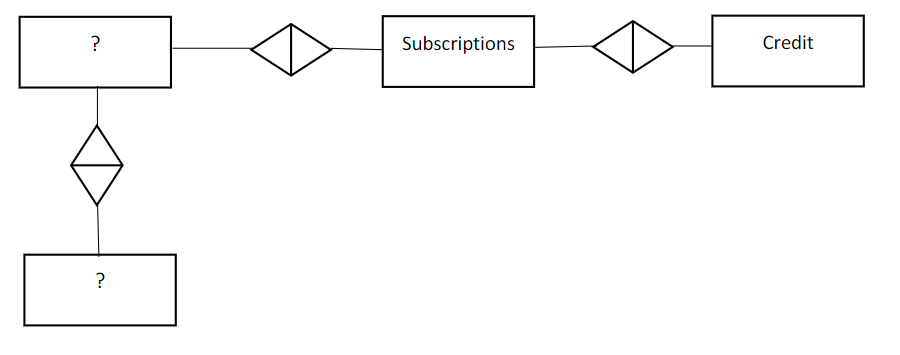

```{r setup, include = FALSE}
knitr::opts_chunk$set(
  #set comment formatting
  comment = ">",
  #collapse code and output
  collapse = F
)
```

# Exercise 1: a newspaper publishing company 
 
Problem description: 

A newspaper publishing company (NPC) has contacted you to address their increasing churn rates. This evolution has been jumpstarted  by  the rise  of  news-websites,  and  has  continued  at  an  accelerating  rate  due  to  the  popularity  of  tablet computers and (social) news-aggregator applications. Hence the NPC requires a predictive retention (or churn) model  in order to predict which customers will not renew their newspaper subscriptions.  Before building a predictive model, the NPC is interested in some relevant graphs concerning their current business. Moreover, they would like to know how the different datasets are connected in their database. The company has provided you four datasets:  
• Customers: contains socio-demographic data about the customers. 
• Subscription: contains information about the subscriptions of NPC’s customers. 
• Complaints: contains data about the complaints a customer has. 
• Credit: contains information about the credit line of the customer with the NPC.


1. Read in the data and get familiar with the data.  
2. Make an ERD. You should also test the relationships of the ERD using R.  You can do this by merging the different tables and counting the occurrence of each ID. For example, you can merge the tables customer and subscription and count the number of customers per subscription and vice versa
```{r pressure, echo=FALSE, fig.cap="A caption", out.width = '100%'}

```

3. NPC’s management would like some answers on the following questions: 
  a. Are the number of subscriptions and customers declining?  
  b. How old are the customers?  
  c. How is the amount of credit evolving over time and what actions do we need to take?  
  d. What is the most common complaint? Why does it happen? What is the solution? 
 
Make use of visuals (e.g., plots in R, ggplots) to ‘show’ and back up your suggestions. Also, try to come up with solutions to possible issues with data quality that show up in the data. 
 
4. Make  predictors  for  5  columns  from  the  Subscriptions  table.  For  the  Customers  table,  the  company  is  only interested in gender. For the Credit and Complaints table, they are only interested in the number of credit lines and the number of  complaints. Merge all tables by CustomerID. Impute the variables when necessary. You can assume that the end of the independent period is today.

```{r exercise 1.1}
customers <-read.csv("customers.txt", header=TRUE, sep = ';')
customers
subscriptions <-read.csv("subscriptions.txt", header=TRUE, sep = ';')
subscriptions
complaints <-read.csv("complaints.txt", header=TRUE, sep = ';')
complaints
credit <-read.csv("credit.txt", header=TRUE, sep = ';')
credit

```
```{r exercise 1.2}
complaints
customers
subscriptions
credit

merged_CustComp <- merge(customers, complaints, by = "CustomerID")
merged_CustComp
unique(merged_CustComp['CustomerID']) #514 unique CustomerID's in merge (1:N relationship)
unique(merged_CustComp['ComplaintID']) #1621 unique ComplaintID's in merge (1:N relationship)
table(is.na(merged_CustComp$CustomerID)) #No customerID null values
table(is.na(merged_CustComp$ComplaintID)) #No complaintID null values


merged_CredSubs <- merge(subscriptions, credit, by = "SubscriptionID")
merged_CredSubs
unique(merged_CredSubs['SubscriptionID']) #680 unique SubscriptionID's in merge (1:N relationship) ~every subscriptionID has a different creditID
unique(merged_CredSubs['CreditID']) #1180 unique CreditID's in merge (1:1 relationship) 
table(is.na(merged_CredSubs$SubscriptionID)) #No subscriptionID null values
table(is.na(merged_CredSubs$CreditID)) #No creditID null values

merged_CustSubs <- merge(customers, subscriptions, by = "CustomerID")
merged_CustSubs
unique(merged_CustSubs['CustomerID']) #1389 unique CustomerID's in merge (1:N relationship)
unique(merged_CustSubs['SubscriptionID']) #8252 unique SubscriptionID's in merge (1:1 relationship)
table(is.na(merged_CustSubs$CustomerID)) #No customerID null values
table(is.na(merged_CustSubs$SubscriptionID)) #No subscriptionID null values


```
 
 
Make use of visuals (e.g., plots in R, ggplots) to ‘show’ and back up your suggestions. Also, try to come up with solutions to possible issues with data quality that show up in the data. 
```{r, exercise 1.3} 
#require(lubridate)
library(ggplot2)
library(lubridate)

#a. Are the number of subscriptions and customers declining?  


#b. How old are the customers?  
customers
#change dob to age first


customers$DOB
str(customers)
#sysdate is of format 2022-02-19
#dob is of format 09/11/1934 but is not a date format. It's a character


#c. How is the amount of credit evolving over time and what actions do we need to take?  


#d. What is the most common complaint? Why does it happen? What is the solution? 
table(complaints$ComplaintType) #Most common complaint is type 1
table(complaints$SolutionType) #Most common solution is type 1, but also 452 Null values

```


# Exercise 2: Weibo, a social media dataset 
 
Problem description:

You want to investigate how a user’s characteristics and posting behavior is related to his/her probability of spamming. 
Three datasets of the Chinese microblogging website Weibo are available: 
  • weibo_user: contains information on the characteristics of 781 users. 
  • user_post: contains information on 40,443 posts of the users. 
  • labels: contains the response variable. Resolves to 1 if the user is identified as a spammer, 0 otherwise.  
Variables related to message (or post) content are not required to be included into the analysis.  

 
Data description  
weibo_user has the following attributes: 
  • user_id: user ID in Weibo 
  • user_name: user nickname 
  • gender: user registration gender 
  • class: user level given by Weibo 
  • message: user registration location or other personal information 
  • post_num: number of posts of this user up to now 
  • follower_num: number of followers of this user 
  • followee_num: number  of  ‘followees’  of  this  user 
 
user_post has the following attributes: 
  • post_id: post ID given by Weibo 
  • post_time: time the post was shared 
  • content: content of the post (in Chinese) 
  • poster_id: user ID of user who shared this post 
  • poster_url: URL-link to the user 
  • repost_num: number of retweets by others 
  • comment_num: number of comments by others 

Questions:
Using  this  dataset, write  code  to  build a  basetable.  Your  basetable  should  contain  at  least  5 variables  (include  dummy, frequency  and  time-based  variables)  and  should  be  in  the  correct  format  to  predict  the  probability  of  spamming.  One specific This  means  that  NA  or  infinite  values  should  be  resolved.  (Tip:  install  and  load  the  package  ‘bit64’  because otherwise reading issues could occur).  
 
Once you created your basetable, you start by creating your first predictive model. You will deploy a logistic regression model. As we haven’t covered train/test splits yet, you can evaluate the model with the use of the AIC measure. 
You suddenly realize that the follower/followee ratio is rather unlikely to follow a monotonic pattern with regard to the spam propensity as both accounts with extremely high or low ratios are perhaps more likely to be spammers. Transform the variable adequately and check the influence this has on performance.

```{r exercise 2}


```

# Exercise 3: Resampling  

The figure below plots the age and gender statistics of the general Facebook population and  our Facebook sample. The plot clearly indicates that our Facebook sample is not representative for the whole population of Facebook. Your task is to make sure that the age and gender distribution of our data sample are in line with the general Facebook population.  

1. Read  in  the  demographics  of  the  general  Facebook  population  (‘Ex3_demographics.csv’)  and  our  Facebook  sample (‘Ex3.Rdata’). For our Facebook sample, the data consists of two columns: age and genderfemale. The age variable is currently expressed in days, the genderfemale variable resolves to 1 if the gender is female. Transform the age variable such that age is expressed in years and the genderfemale variable such that it is a factor with two factors , namely ‘M’ and ‘V’. 

demographics <- read.csv("Ex3_demographics.csv", header = TRUE, sep = ";")
load("Ex3.Rdata")

fb_oursample$age = round(fb_oursample$age/365)
fb_oursample$genderfemale = ifelse(fb_oursample$genderfemale == 1, "F", "M")
head(fb_oursample)

2. The following age groups are present: 13-24, 25-34, 35-54, and 55+. Transform our Facebook sample such that we have the distribution per age group and gender.

min(fb_oursample$age)

fb_oursample$ageCat <- cut(fb_oursample$age, 
                          breaks = c(0,25,35,55, Inf), 
                          include.lowest=TRUE, 
                          labels = c("13-24", "25-34", "35-54", "55+"))
head(fb_oursample)

library(dplyr)
library(ggplot2)

fb_oursample %>% 
  count(gender, ageCat) %>% 
  group_by(ageCat) %>%
  mutate(Percent = n / 2000) %>%
  ggplot(aes(x = ageCat, y = Percent, fill = factor(gender)))+
  geom_col(position = position_dodge())+
  scale_y_continuous(labels = scales::percent)+
  scale_fill_discrete(name = "Gender", labels = c("Female", "Male"))
  
3. Resample our data such that the distribution per age and gender are the same as the whole Facebook population. The best strategy is to determine how many of the total observations of our sample should be present in the current age groups to have the same distribution of the general Facebook population. For example, we have 2000 users  in  our  sample,  if  we  want  the  have  12.76%  of  women  in  the  age  group  13  to  24,  we  should  have  255 observation in this group (12.76% * 2000).   For age groups that are over-represented in our sample, you should select a random sample with the desired size. For example, men between 13-24 are over-represented in our data set, so we take a random sample with sample size equal to  358. For age groups that are under-represented in our  data  set,  we  sample  observations  with  replacement.  For  example,  men  in  the  age  group  55+  are  under-represented, so we sample the observations in this age group with a sample size of 89  (i.e., we create duplicates of these observations).  

4. Plot the graph showing the age and gender distribution for the general Facebook population and our original sample  (i.e.,  recreate  the graph  below).    Also  plot  a  graph  with  the  overall  sex  distribution  for  the  general Facebook  population  and  our  original  sample.  Then  redo  the  same  but  with  your  resampled  data  set.  Did  the sample converge to the desired overall distribution?

```{r exercise 3}


```


